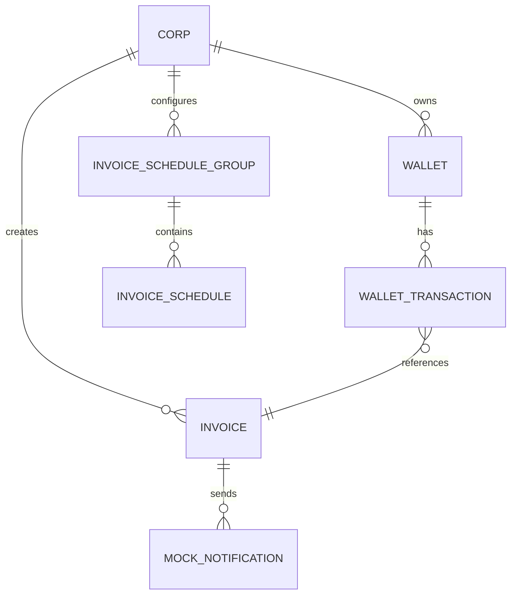

## 0) 목표

“써볼 수 있는 느낌”의 **운영형 Billing Demo**를 만든다.

* 어드민이 학원(Corp)에 **무료 포인트 지급**
* 포인트로 **청구서 즉시 발송**
* **예약/정기 발송 등록**
* **데모용 스케줄러 실행 API**로 예약 청구 실행
* 실제 발송은 **Mock**(DB 로그 저장)으로 대체

> 실서비스 수준 복잡도(ChargePayment / PointUsageDetail 등)는 스킵하고, 핵심 아이디어(정합성/스케줄링/보상)를 “작게” 보여준다.

---

## 1) 범위 (MVP 스코프)

### 포함 (필수)

1. Admin 무료 포인트 지급
2. Invoice 즉시 발송
3. InvoiceScheduleGroup + InvoiceSchedule 등록 (ONCE/RECURRING)
   * 별도 Template 엔티티 없이 ScheduleGroup에 청구서 정보 직접 포함
4. 데모 스케줄러 실행 엔드포인트
5. Mock 발송 로그 조회

### 제외 (명시적으로 안 함)

* PG 연동, 외부 SMS/카톡 발송
* 사용자 인증/권한(토큰 등) → 데모에서는 생략
* 부분 환불, 출처 기반 환불(usage detail graph)
* 멀티 클러스터/복잡한 GitOps (Helm 배포는 포함 가능)

---

## 2) 핵심 설계 원칙

### 2.1 Wallet/Refund 단순화 (데모 정책)

* `Wallet` : 잔액
* `WalletTransaction` : 불변 원장(ledger)
* 환불은 "사용 트랜잭션"의 보상으로 **별도 트랜잭션 한 줄 추가**로 처리

#### 청구서 발송 비용

* **건당 100원 고정** (Invoice amount와 무관)
* Invoice amount는 학생에게 청구할 금액
* Wallet 차감은 발송 비용으로만 사용

#### WalletTransactionType

* `FREE_CHARGE` : 어드민 무료 지급 (+)
* `INVOICE_USE` : 청구 발송 차감 (건당 100원)
* `INVOICE_REFUND` : 발송 실패/취소 환불 (+100원)

#### 주요 필드

* `invoiceId` (nullable)
* `relatedTransactionId` (nullable)
    * 환불이 어떤 사용 트랜잭션의 보상인지 연결

### 2.2 Outbox Pattern

* 이벤트 기반 비동기 처리 (Invoice 발송)
* `OutboxEvent` 테이블로 안정적인 이벤트 발행
* `OutboxEventProcessor`가 주기적으로 PENDING 이벤트 처리
* 발송 실패 시 자동 보상 (Wallet 환불)

### 2.3 Spring Batch

* 스케줄러 실행은 Spring Batch로 구현
* Chunk 단위 처리 (페이징)
* 트랜잭션 경계가 명확한 안전한 처리

### 2.4 Soft Delete

* `InvoiceScheduleGroup` 삭제 시 물리적 삭제 대신 `deleted_at` 설정
* 관련 `InvoiceSchedule`은 유지 (이력 보존)
* `@Where(clause = "deleted_at IS NULL")`로 조회 시 자동 필터링

---

## 3) 패키지 구조

```text
tkdlqh2.schedule_invoice_demo
  ├─ corp
  │    ├─ controller
  │    │    └─ AdminCorpController.java
  │    ├─ command
  │    │    └─ CreateCorpCommand.java
  │    ├─ dto
  │    │    ├─ CreateCorpRequest.java
  │    │    └─ CorpResponse.java
  │    ├─ Corp.java
  │    ├─ CorpRepository.java
  │    └─ CorpService.java
  ├─ wallet
  │    ├─ controller
  │    │    └─ AdminWalletController.java
  │    ├─ command
  │    │    └─ FreeChargeCommand.java
  │    ├─ dto
  │    │    └─ FreeChargeRequest.java
  │    ├─ Wallet.java
  │    ├─ WalletTransaction.java
  │    ├─ WalletTransactionType.java
  │    ├─ WalletService.java
  │    ├─ WalletRepository.java
  │    └─ WalletTransactionRepository.java
  ├─ invoice
  │    ├─ controller
  │    │    └─ AdminInvoiceController.java
  │    ├─ command
  │    │    └─ SendInvoiceImmediatelyCommand.java
  │    ├─ dto
  │    │    ├─ SendInvoiceImmediatelyRequest.java
  │    │    └─ SendInvoiceImmediatelyResponse.java
  │    ├─ Invoice.java
  │    ├─ InvoiceStatus.java
  │    ├─ InvoiceRepository.java
  │    ├─ InvoiceService.java
  │    ├─ InvoiceNotificationSender.java (interface)
  │    └─ MockInvoiceNotificationSender.java
  ├─ schedule
  │    ├─ controller
  │    │    ├─ ScheduleController.java
  │    │    └─ DemoSchedulerController.java
  │    ├─ command
  │    │    └─ CreateInvoiceScheduleCommand.java
  │    ├─ dto
  │    │    ├─ CreateInvoiceScheduleRequest.java
  │    │    ├─ CreateInvoiceScheduleResponse.java
  │    │    ├─ RunSchedulerRequest.java
  │    │    └─ RunSchedulerResponse.java
  │    ├─ batch (Spring Batch)
  │    │    ├─ InvoiceScheduleBatchConfig.java
  │    │    ├─ InvoiceScheduleItemReader.java
  │    │    ├─ InvoiceScheduleItemProcessor.java
  │    │    ├─ InvoiceScheduleItemWriter.java
  │    │    └─ ScheduleProcessResult.java
  │    ├─ InvoiceScheduleGroup.java
  │    ├─ InvoiceSchedule.java
  │    ├─ ScheduleType.java
  │    ├─ ScheduleStatus.java
  │    ├─ IntervalUnit.java
  │    ├─ InvoiceSchedulerService.java
  │    ├─ InvoiceScheduleService.java
  │    ├─ InvoiceScheduleGroupRepository.java
  │    └─ InvoiceScheduleRepository.java
  ├─ outbox (Outbox Pattern)
  │    ├─ handler
  │    │    └─ InvoiceSendRequestedEventHandler.java
  │    ├─ OutboxEvent.java
  │    ├─ OutboxEventStatus.java
  │    ├─ OutboxEventType.java
  │    ├─ OutboxEventRepository.java
  │    ├─ OutboxEventHandler.java (interface)
  │    ├─ OutboxEventProcessor.java
  │    └─ OutboxEventProcessorService.java
  ├─ mock
  │    ├─ MockNotification.java
  │    └─ MockNotificationRepository.java
  └─ common
       └─ BaseTimeEntity.java
```

---

## 4) ERD (README/노션용)



주요 관계:
* `InvoiceScheduleGroup`: 청구서 템플릿 정보 포함 (studentName, guardianPhone, amount, description)
* `InvoiceSchedule`: 실행 스케줄 (scheduledAt, status)
* `WalletTransaction`: invoiceId로 어떤 청구서에 사용/환불되었는지 추적

---

## 5) API 명세 (Draft)

> **데모이므로 인증/권한 생략**
> * 기관(Corp) 로그인 미구현
> * API path에 `{corpId}` 직접 포함하여 사용
> * Swagger로 시나리오 체험 가능해야 함

### 5.1 Admin: 무료 포인트 지급

`POST /admin/corps/{corpId}/wallet/free-charge`

Body:

```json
{
  "amount": 100000,
  "reason": "데모 무료 포인트 지급"
}
```

Flow:

1. Corp 존재 여부 확인
2. Wallet 없으면 생성 (Corp 당 1개)
3. Wallet.balance += amount
4. WalletTransaction 생성:
   * type: FREE_CHARGE
   * amount: +100000
   * reason: "데모 무료 포인트 지급"
   * invoiceId: null

> **참고**: 실제 청구서 발송 비용은 건당 100원이므로, 100,000원이면 1,000건의 청구서를 발송할 수 있습니다.

---

### 5.2 즉시 청구서 발송

`POST /app/corps/{corpId}/invoices/send`

Body:

```json
{
  "studentName": "홍길동",
  "guardianPhone": "010-1111-2222",
  "amount": 50000,
  "description": "2025년 1월 수업료"
}
```

Flow:

1. Wallet 조회 및 잔액 확인 (balance >= 100원)
   * 잔액 부족 시 예외 발생
2. Invoice 생성 (status: PENDING)
3. WalletTransaction 생성:
   * type: INVOICE_USE
   * amount: 100 (고정 비용)
   * invoiceId: 생성된 Invoice ID
4. Wallet.balance -= 100
5. OutboxEvent 생성 (INVOICE_SEND_REQUESTED)
   * 비동기 발송 처리를 위한 이벤트

> **트랜잭션 처리**
> * 1~5 단계는 하나의 트랜잭션으로 처리
> * 실패 시 모든 변경사항 롤백
>
> **비동기 발송 처리**
> * OutboxEventProcessor가 주기적으로 PENDING 이벤트 처리
> * 발송 성공: Invoice 상태 PENDING → SENT, MockNotification 생성
> * 발송 실패: Invoice 상태 PENDING → FAILED, Wallet 환불 (INVOICE_REFUND +100원)

---

### 5.3 예약/정기 스케줄 등록

`POST /app/corps/{corpId}/invoice-schedules`

Body:

```json
{
  "scheduleType": "RECURRING",
  "scheduledAt": "2025-12-10T10:00:00",
  "intervalUnit": "MONTH",
  "intervalValue": 1,
  "studentName": "홍길동",
  "guardianPhone": "010-1111-2222",
  "amount": 50000,
  "description": "매월 수업료"
}
```

* scheduleType: `ONCE` (1회) 또는 `RECURRING` (반복)
* scheduledAt: 첫 실행 시각 (ONCE인 경우 해당 시각에만 실행)
* intervalUnit: RECURRING일 때만 사용 (`DAY`, `WEEK`, `MONTH`, `YEAR`)
* intervalValue: RECURRING일 때만 사용 (반복 주기 값, 예: 1=매 단위마다, 2=2단위마다)

Flow:
* InvoiceScheduleGroup 생성 (청구서 템플릿 정보 포함)
* InvoiceSchedule(READY) 생성
    * ONCE면 1개만, scheduledAt에 실행
    * RECURRING이면 scheduledAt부터 시작하여 intervalUnit/intervalValue로 반복

#### ScheduleGroup 관리 정책

> **중요: ScheduleGroup은 수정(UPDATE) 불가**
> * ScheduleGroup은 **생성(CREATE)과 삭제(DELETE)만 가능**
> * 스케줄 내용을 변경하려면 기존 ScheduleGroup을 삭제하고 새로 생성
> * 이유: 이미 실행된 스케줄의 이력과 향후 스케줄의 일관성 보장
> * API:
>   * 생성: `POST /app/corps/{corpId}/invoice-schedules`
>   * 조회: `GET /app/corps/{corpId}/invoice-schedules`
>   * 삭제: `DELETE /app/corps/{corpId}/invoice-schedules/{scheduleGroupId}` (Soft Delete)
>   * ~~수정: PUT/PATCH 엔드포인트 제공하지 않음~~
>
> **Soft Delete 정책**
> * 삭제 시 물리적 삭제 대신 `deleted_at` 타임스탬프 설정
> * 관련 `InvoiceSchedule`은 유지되어 이력 보존
> * 조회 시 삭제된 그룹은 자동으로 제외됨

---

### 5.4 데모 스케줄러 실행

`POST /internal/demo/run-scheduler`

Body (선택):

```json
{ "executeAt": "2025-12-10T10:00:00" }
```

* executeAt: 생략 시 현재 시각 사용

Flow (Spring Batch로 구현):

1. `status = READY AND scheduledAt <= executeAt` 인 스케줄 조회 (페이징)
2. Spring Batch Chunk Processing:
   * **Reader**: 스케줄 페이지 단위 조회
   * **Processor**: 각 스케줄 처리
       * 상태 변경: `READY → PROCESSING`
       * Wallet 잔액 확인 및 차감 (INVOICE_USE, 건당 100원)
       * Invoice 생성 (ScheduleGroup의 템플릿 정보 사용)
       * OutboxEvent 생성 (INVOICE_SEND_REQUESTED)
       * 성공 시 ScheduleProcessResult.success 반환
       * 실패 시 ScheduleProcessResult.failure 반환
   * **Writer**: 결과 처리
       * 성공: `PROCESSING → COMPLETED`
       * RECURRING인 경우: 다음 InvoiceSchedule 생성
       * 실패: `PROCESSING → FAILED`, failureReason 저장

> **동시성 제어**
> * Wallet 조회 시 비관적 락 (SELECT FOR UPDATE) 사용
> * Spring Batch의 트랜잭션 경계로 안전한 처리 보장
>
> **보상 트랜잭션**
> * OutboxEventProcessor가 발송 실패 감지 시 자동 환불
> * Wallet 차감 후 실패한 경우에만 보상 수행

---

### 5.5 Mock 발송 로그 조회

`GET /admin/mock-notifications?corpId={corpId}`

Query Parameters:
* corpId (선택): 특정 기관의 발송 로그만 조회

Response:
```json
[
  {
    "id": 1,
    "invoiceId": 123,
    "corpId": 1,
    "studentName": "홍길동",
    "guardianPhone": "010-1111-2222",
    "amount": 50000,
    "description": "2025년 1월 수업료",
    "sentAt": "2025-12-10T10:00:00"
  }
]
```

* "실제 발송 대신 DB에 기록"을 보여주는 데모용 API
* 실제 운영에서는 외부 발송 시스템(SMS/카카오톡) 연동

---

## 6) 상태 머신 (데모 버전)

### InvoiceStatus

* PENDING: 청구서 생성됨, 발송 전
* SENT: 발송 완료
* FAILED: 발송 실패 (환불 처리됨)

전이:
* PENDING → SENT (정상 발송)
* PENDING → FAILED (발송 실패, 포인트 환불)

### ScheduleStatus

* READY: 실행 대기 중
* PROCESSING: 실행 중
* COMPLETED: 실행 완료
* FAILED: 실행 실패 (환불 처리됨)

전이:
* READY → PROCESSING → COMPLETED (정상 실행)
* READY → PROCESSING → FAILED (실행 실패, 포인트 환불)

> **상태 관리 원칙**
> * 상태별 메서드로 불변식(중복 처리 방지) 보장
> * 상태 전이는 명시적 메서드 호출로만 가능

---

## 7) 로컬 실행

### 7.1 Swagger

* `/swagger-ui/index.html` 제공
* README에 데모 시나리오 Step-by-step로 안내

---

## 8) README에 반드시 포함할 섹션

1. 프로젝트 개요(왜 만들었는지)
2. What this demo shows (핵심 기능)
3. Tech Stack
4. Domain Model (단순화 설명 포함)
5. API 시나리오(1~6단계)
6. Refund 단순화 설명
    * 실서비스는 더 복잡하지만 데모는 wallet transaction으로 단순화했다
7. Limitations (안 한 것들 명시)

---

## 9) Helm 배포

* chart 이름: `billing-demo`
* values:
    * image.repository / tag
    * env: DB_URL, DB_USER, DB_PASS
* k8s objects:
    * Deployment, Service
    * (옵션) Ingress
* PostGreSQL은:

    * 데모에선 외부(RDS) 가정하거나
    * 간단히 Bitnami chart dependency로 구성 가능(시간 보고 결정)

---