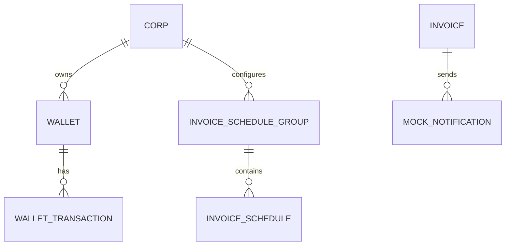

## 0) 목표

“써볼 수 있는 느낌”의 **운영형 Billing Demo**를 만든다.

* 어드민이 학원(Corp)에 **무료 포인트 지급**
* 포인트로 **청구서 즉시 발송**
* **예약/정기 발송 등록**
* **데모용 스케줄러 실행 API**로 예약 청구 실행
* 실제 발송은 **Mock**(DB 로그 저장)으로 대체

> 실서비스 수준 복잡도(ChargePayment / PointUsageDetail 등)는 스킵하고, 핵심 아이디어(정합성/스케줄링/보상)를 “작게” 보여준다.

---

## 1) 범위 (MVP 스코프)

### 포함 (필수)

1. Admin 무료 포인트 지급
2. InvoiceTemplate 생성
3. Invoice 즉시 발송
4. InvoiceScheduleGroup + InvoiceSchedule 등록 (ONCE/RECURRING)
5. 데모 스케줄러 실행 엔드포인트
6. Mock 발송 로그 조회

### 제외 (명시적으로 안 함)

* PG 연동, 외부 SMS/카톡 발송
* 사용자 인증/권한(토큰 등) → 데모에서는 생략
* 부분 환불, 출처 기반 환불(usage detail graph)
* 멀티 클러스터/복잡한 GitOps (Helm 배포는 포함 가능)

---

## 2) 핵심 설계 원칙

### 2.1 Wallet/Refund 단순화 (데모 정책)

* `Wallet` : 잔액
* `WalletTransaction` : 불변 원장(ledger)
* 환불은 “사용 트랜잭션”의 보상으로 **별도 트랜잭션 한 줄 추가**로 처리

#### WalletTransactionType

* `FREE_CHARGE` : 어드민 무료 지급 (+)
* `INVOICE_USE` : 청구 발송 차감 (-)
* `INVOICE_REFUND` : 발송 실패/취소 환불 (+)

#### 추천 필드

* `invoiceId` (nullable)
* `relatedTransactionId` (nullable)

    * 환불이 어떤 사용 트랜잭션의 보상인지 연결

---

## 3) 패키지 구조 (추천)

```text
com.yhj.billingdemo
  ├─ corp
  │    ├─ Corp.java
  │    └─ CorpRepository.java
  ├─ wallet
  │    ├─ Wallet.java
  │    ├─ WalletTransaction.java
  │    ├─ WalletTransactionType.java
  │    ├─ WalletService.java
  │    ├─ WalletRepository.java
  │    └─ WalletTransactionRepository.java
  ├─ invoice
  │    ├─ Invoice.java
  │    ├─ InvoiceStatus.java
  │    ├─ InvoiceRepository.java
  │    └─ InvoiceService.java
  ├─ schedule
  │    ├─ InvoiceScheduleGroup.java
  │    ├─ InvoiceSchedule.java
  │    ├─ ScheduleType.java
  │    ├─ ScheduleStatus.java
  │    ├─ InvoiceSchedulerService.java
  │    ├─ InvoiceScheduleGroupRepository.java
  │    └─ InvoiceScheduleRepository.java
  ├─ mock
  │    ├─ MockNotification.java
  │    ├─ MockNotificationRepository.java
  │    └─ MockNotificationService.java
  ├─ api
  │    ├─ AdminWalletController.java
  │    ├─ InvoiceController.java
  │    ├─ ScheduleController.java
  │    └─ MockController.java
  └─ common
       ├─ BaseTimeEntity.java
       ├─ ApiResponse.java (optional)
       └─ BizException.java
```

---

## 4) ERD (README/노션용)



---

## 5) API 명세 (Draft)

> 데모이므로 인증/권한 생략. Swagger로 시나리오 체험 가능해야 함.

### 5.1 Admin: 무료 포인트 지급

`POST /admin/corps/{corpId}/wallet/free-charge`

Body:

```json
{ "amount": 100000, "reason": "demo free points" }
```

Flow:

* Wallet 없으면 생성
* Wallet.balance += amount
* WalletTransaction(FREE_CHARGE, +amount)

---

### 5.2 즉시 청구서 발송

`POST /app/corps/{corpId}/invoices/send`

Body:

```json
{
  "studentName": "홍길동",
  "guardianPhone": "010-1111-2222",
  "amount": 1000,
  "reason" : "선물비"
}
```

Flow:
* 잔액 확인
* WalletTransaction(INVOICE_USE, -amount, invoiceId)
* Invoice 생성
* MockNotification 생성(또는 Outbox 후처리로 생성)

---

### 5.3 예약/정기 스케줄 등록

`POST /app/corps/{corpId}/invoice-schedules`

Body:

```json
{
  "scheduleType": "RECURRING",
  "startDate": "2025-12-01",
  "endDate": "2026-12-01",
  "cron": "0 0 10 10 * ?"
}
```

* InvoiceScheduleGroup 생성
* InvoiceSchedule(READY) 생성

    * ONCE면 1개만
    * RECURRING이면 firstRunAt 기준으로 다음 runAt 계산은 단순화 가능(데모용)

---

### 5.4 데모 스케줄러 실행

`POST /internal/demo/run-scheduler`

Body:

```json
{ "now": "2025-11-10T10:00:00" }
```

Flow(중요):

* READY & scheduledAt <= now 대상 조회
* 상태 변경: READY → PROCESSING
* try:

    * Wallet 차감 (INVOICE_USE)
    * Invoice 생성
    * MockNotification 생성
    * COMPLETED
* catch:

    * (차감 성공 후 실패면) INVOICE_REFUND (+amount, relatedTransactionId)
    * FAILED

> (옵션) 조회 쿼리에서 동시성 고려
> 데모는 단일 인스턴스라도 “멀티 워커 가정”이라는 설명을 README에 남길 것.

---

### 5.5 Mock 발송 로그 조회

`GET /admin/mock-notifications`

* “실제 발송 대신 DB에 기록”을 보여주는 데모용 API

---

## 6) 상태 머신 (데모 버전)

### ScheduleStatus

* READY
* PROCESSING
* COMPLETED
* FAILED

전이:

* READY → PROCESSING → COMPLETED
* READY → PROCESSING → FAILED

> 상태별 메서드로 불변식(중복 처리 방지)을 보장하도록 구현.

---

## 7) 로컬 실행

### 7.1 Swagger

* `/swagger-ui/index.html` 제공
* README에 데모 시나리오 Step-by-step로 안내

---

## 8) README에 반드시 포함할 섹션

1. 프로젝트 개요(왜 만들었는지)
2. What this demo shows (핵심 기능)
3. Tech Stack
4. Domain Model (단순화 설명 포함)
5. API 시나리오(1~6단계)
6. Refund 단순화 설명
    * 실서비스는 더 복잡하지만 데모는 wallet transaction으로 단순화했다
7. Limitations (안 한 것들 명시)

---

## 9) Helm 배포

* chart 이름: `billing-demo`
* values:
    * image.repository / tag
    * env: DB_URL, DB_USER, DB_PASS
* k8s objects:
    * Deployment, Service
    * (옵션) Ingress
* PostGreSQL은:

    * 데모에선 외부(RDS) 가정하거나
    * 간단히 Bitnami chart dependency로 구성 가능(시간 보고 결정)

---