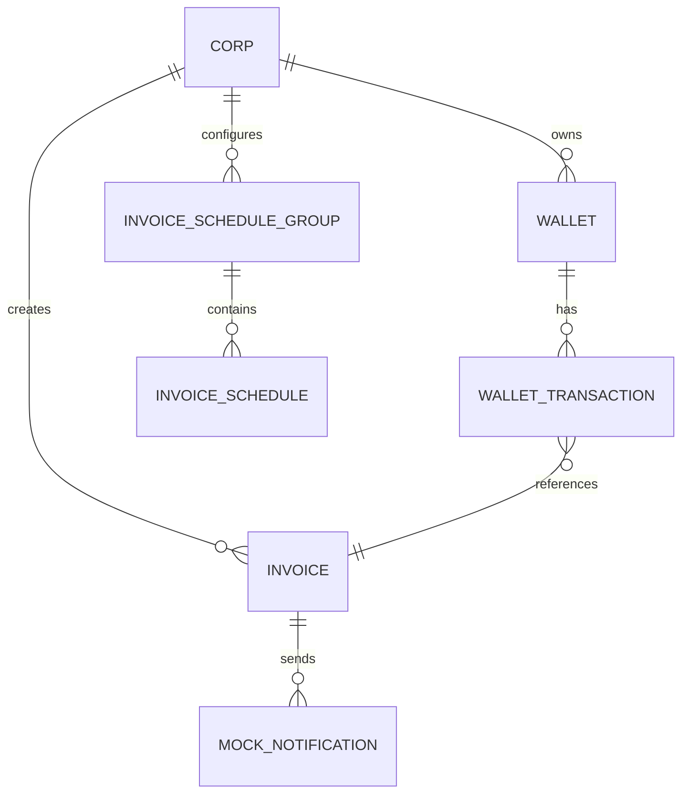

# Schedule Invoice Demo

> "써볼 수 있는 느낌"의 운영형 Billing Demo

학원(교육 기관)이 학생/학부모에게 청구서를 발송하는 시스템의 핵심 기능을 구현한 데모 프로젝트입니다.

## 프로젝트 개요

실제 서비스에서 사용되는 청구 시스템의 핵심 패턴(정합성 보장, 스케줄링, 보상 트랜잭션)을 간결하게 보여주는 것이 목표입니다.

### 왜 만들었나요?

- **Billing 시스템의 핵심 패턴 학습**: Wallet 기반 포인트 차감, Outbox Pattern, 보상 트랜잭션
- **스케줄링 시스템 구현**: 예약/정기 발송 기능과 Spring Batch 기반 안전한 처리
- **데이터 정합성 보장**: 비관적 락, 이벤트 기반 비동기 처리로 안정성 확보
- **실무 수준의 아키텍처**: 복잡도는 낮추되, 실제 서비스와 유사한 설계 원칙 적용

---

## 핵심 기능 (What This Demo Shows)

### 1. Admin 무료 포인트 지급
- 관리자가 학원에 무료 포인트를 지급
- Wallet 잔액 증가 + WalletTransaction 기록

### 2. 청구서 즉시 발송
- 학원이 학생/학부모에게 청구서를 즉시 발송
- **건당 100원 고정 비용** 차감 (Invoice amount와 무관)
- Outbox Pattern으로 비동기 발송 처리

### 3. 예약/정기 발송 등록
- **ONCE**: 특정 시각에 1회 발송
- **RECURRING**: 주기적 반복 발송 (일/주/월/년)
- InvoiceScheduleGroup에 청구서 템플릿 정보 포함

### 4. 데모 스케줄러 실행
- Spring Batch 기반 안전한 스케줄 처리
- Chunk 단위 페이징 처리
- 비관적 락으로 동시성 제어

### 5. 발송 실패 시 자동 환불
- Outbox Event 처리 중 실패 감지
- Wallet에 발송 비용(100원) 자동 환불
- WalletTransaction으로 보상 트랜잭션 기록

### 6. Mock 발송 로그 조회
- 실제 SMS/카톡 발송 대신 DB에 기록
- 발송 이력 조회 가능

---

## 기술 스택

### Backend
- **Java 21**
- **Spring Boot 3.4.1**
- **Spring Data JPA** (Hibernate)
- **Spring Batch** (스케줄러 처리)
- **PostgreSQL** (메인 DB)

### Build & DevOps
- **Gradle 9.2.1**
- **Docker** (컨테이너화)
- **Helm** (Kubernetes 배포, 선택적)

### Key Patterns
- **Outbox Pattern**: 안정적인 이벤트 발행
- **Pessimistic Lock**: Wallet 동시성 제어
- **Soft Delete**: InvoiceScheduleGroup 삭제 시 이력 보존
- **Compensation Transaction**: 발송 실패 시 자동 환불

---

## 도메인 모델

### 핵심 엔티티

#### Corp (학원/기관)
- 청구서를 발송하는 주체
- 1개의 Wallet 소유

#### Wallet & WalletTransaction
- **Wallet**: 학원의 포인트 잔액
- **WalletTransaction**: 불변 원장(ledger), 모든 거래 이력 기록
- **TransactionType**:
  - `FREE_CHARGE`: 관리자 무료 지급 (+)
  - `INVOICE_USE`: 청구서 발송 비용 차감 (-100원)
  - `INVOICE_REFUND`: 발송 실패 시 환불 (+100원)

#### Invoice
- 청구서 (학생/학부모에게 발송할 청구 정보)
- **상태**: `PENDING` → `SENT` (성공) / `FAILED` (실패)
- **발송 비용**: 건당 100원 고정 (Invoice amount는 학생에게 청구할 금액)

#### InvoiceScheduleGroup & InvoiceSchedule
- **ScheduleGroup**: 청구서 템플릿 정보 + 스케줄 설정
  - 수정 불가 (CREATE/DELETE만 가능)
  - Soft Delete로 이력 보존
- **Schedule**: 실행 스케줄 (scheduledAt, status)
  - ONCE: 1회 실행
  - RECURRING: 실행 완료 후 다음 스케줄 자동 생성

#### OutboxEvent
- 비동기 이벤트 발행을 위한 Outbox Pattern 구현
- `OutboxEventProcessor`가 주기적으로 PENDING 이벤트 처리
- 발송 성공/실패 처리 및 보상 트랜잭션

#### MockNotification
- 실제 발송 대신 DB에 기록하는 Mock 로그
- 데모 환경에서 발송 이력 확인용

---

## ERD



### 주요 관계
- `InvoiceScheduleGroup`: 청구서 템플릿 정보 포함 (studentName, guardianPhone, amount, description)
- `InvoiceSchedule`: 실행 스케줄 (scheduledAt, status)
- `WalletTransaction`: invoiceId로 어떤 청구서에 사용/환불되었는지 추적

---

## API 시나리오 (데모 체험 가이드)

> Swagger UI: `http://localhost:8080/swagger-ui/index.html`

### 사전 준비: Corp 생성 (선택)
프로젝트에 이미 Corp가 존재한다면 이 단계는 건너뛰세요.

```http
POST /admin/corps
Content-Type: application/json

{
  "name": "테스트 학원"
}
```

응답에서 `corpId`를 확인하세요 (예: `123e4567-e89b-12d3-a456-426614174000`).

---

### Step 1: 무료 포인트 지급

관리자가 학원에 무료 포인트를 지급합니다.

```http
POST /admin/corps/{corpId}/wallet/free-charge
Content-Type: application/json

{
  "amount": 100000,
  "reason": "데모 무료 포인트 지급"
}
```

**결과**:
- Wallet 생성 (없는 경우) + 잔액 100,000원 증가
- 100,000원이면 1,000건의 청구서 발송 가능 (건당 100원)

---

### Step 2: 즉시 청구서 발송

학원이 학생에게 청구서를 즉시 발송합니다.

```http
POST /admin/corps/{corpId}/invoices/send-now
Content-Type: application/json

{
  "studentName": "홍길동",
  "guardianPhone": "010-1111-2222",
  "amount": 50000,
  "description": "2025년 1월 수업료"
}
```

**처리 과정**:
1. Invoice 생성 (PENDING 상태)
2. Wallet에서 100원 차감
3. WalletTransaction 생성 (INVOICE_USE)
4. OutboxEvent 생성 (비동기 발송 대기)
5. OutboxEventProcessor가 1초마다 이벤트 처리
   - 성공: Invoice → SENT, MockNotification 생성
   - 실패: Invoice → FAILED, Wallet 환불 (+100원)

---

### Step 3: 예약 발송 등록 (ONCE)

특정 시각에 1회만 발송하는 스케줄을 등록합니다.

```http
POST /app/corps/{corpId}/invoice-schedules
Content-Type: application/json

{
  "scheduleType": "ONCE",
  "scheduledAt": "2025-12-15T10:00:00",
  "studentName": "김철수",
  "guardianPhone": "010-2222-3333",
  "amount": 80000,
  "description": "겨울방학 특강"
}
```

**결과**:
- InvoiceScheduleGroup 생성
- InvoiceSchedule 1개 생성 (2025-12-15 10:00에 실행 예정)

---

### Step 4: 정기 발송 등록 (RECURRING)

매월 반복 발송하는 스케줄을 등록합니다.

```http
POST /app/corps/{corpId}/invoice-schedules
Content-Type: application/json

{
  "scheduleType": "RECURRING",
  "scheduledAt": "2025-12-10T10:00:00",
  "intervalUnit": "MONTH",
  "intervalValue": 1,
  "studentName": "이영희",
  "guardianPhone": "010-3333-4444",
  "amount": 120000,
  "description": "매월 정기 수업료"
}
```

**결과**:
- InvoiceScheduleGroup 생성
- 첫 InvoiceSchedule 생성 (2025-12-10 10:00에 실행)
- 실행 완료 후 다음 스케줄 자동 생성 (2026-01-10 10:00)

---

### Step 5: 스케줄러 실행 (데모용)

등록된 스케줄을 강제로 실행합니다.

```http
POST /internal/demo/run-scheduler
Content-Type: application/json

{
  "executeAt": "2025-12-15T10:00:00"
}
```

**파라미터**:
- `executeAt` (선택): 실행 기준 시각 (생략 시 현재 시각)
- `scheduledAt <= executeAt`인 READY 상태 스케줄들이 처리됨

**처리 과정** (Spring Batch):
1. 실행 대상 스케줄 조회
2. Chunk 단위 처리 (10개씩)
3. 각 스케줄마다:
   - Wallet 비관적 락 획득
   - 잔액 확인 및 100원 차감
   - Invoice 생성 + OutboxEvent 생성
   - 상태: READY → PROCESSING → COMPLETED
   - RECURRING인 경우: 다음 스케줄 생성

**실패 처리**:
- 잔액 부족 등으로 실패 시: 상태 → FAILED, failureReason 저장
- OutboxEvent 처리 실패 시: 자동 환불 (INVOICE_REFUND)

---

### Step 6: Mock 발송 로그 조회

발송된 청구서 로그를 확인합니다.

```http
GET /admin/mock-notifications?corpId={corpId}
```

**쿼리 파라미터**:
- `corpId` (선택): 특정 학원의 발송 로그만 조회 (생략 시 전체 조회)

**응답**:
```json
[
  {
    "id": 1,
    "invoiceId": 123,
    "corpId": "123e4567-e89b-12d3-a456-426614174000",
    "studentName": "홍길동",
    "guardianPhone": "010-1111-2222",
    "amount": 50000,
    "description": "2025년 1월 수업료",
    "sentAt": "2025-12-10T10:00:00"
  }
]
```

---

### Step 7: 스케줄 조회

등록된 스케줄을 조회합니다.

```http
GET /app/corps/{corpId}/invoice-schedules
```

---

### Step 8: 스케줄 삭제 (Soft Delete)

스케줄을 삭제합니다.

```http
DELETE /app/corps/{corpId}/invoice-schedules/{scheduleGroupId}
```

**동작**:
- 물리적 삭제 대신 `deleted_at` 설정 (Soft Delete)
- 관련 InvoiceSchedule은 유지 (이력 보존)
- 조회 시 삭제된 그룹은 자동 제외

---

## 환불 정책 (데모 버전 단순화)

### 실제 서비스 vs 데모

**실제 서비스**:
- ChargePayment, PointUsageDetail 등 복잡한 출처 추적
- 부분 환불, 출처 기반 환불 정책
- 사용자별 환불 우선순위

**이 데모**:
- WalletTransaction 한 줄 추가로 환불 처리
- `relatedTransactionId`로 원본 트랜잭션 연결
- 발송 실패 시 100원 전액 자동 환불

### 환불 처리 흐름

```
1. Invoice 발송 요청
   - WalletTransaction: INVOICE_USE (-100원)

2. Outbox Event 처리 중 실패 감지

3. 자동 환불
   - WalletTransaction: INVOICE_REFUND (+100원)
   - relatedTransactionId: 원본 INVOICE_USE 트랜잭션 ID
```

---

## 제한사항 (Limitations)

이 데모에서 **의도적으로 구현하지 않은 것들**:

### 외부 연동
- PG 연동 (실제 결제)
- SMS/카카오톡 발송 (MockNotification으로 대체)

### 인증/권한
- 사용자 인증 (토큰, 세션)
- API 권한 관리
- Corp 로그인 기능

### 복잡한 환불 로직
- 부분 환불
- 출처 기반 환불 (usage detail graph)
- 환불 우선순위 정책

### 운영 기능
- 멀티 클러스터 배포
- 복잡한 GitOps 파이프라인
- 모니터링/알림 시스템

---

## 로컬 실행

### 사전 준비

1. **Java 21** 설치
2. **Docker** 설치 (PostgreSQL 컨테이너)

### PostgreSQL 실행

```bash
docker run -d \
  --name schedule-invoice-postgres \
  -e POSTGRES_DB=schedule_invoice \
  -e POSTGRES_USER=postgres \
  -e POSTGRES_PASSWORD=postgres \
  -p 5432:5432 \
  postgres:16
```

### 애플리케이션 실행

```bash
./gradlew bootRun
```

### Swagger UI 접속

```
http://localhost:8080/swagger-ui/index.html
```

---

## 패키지 구조

```text
tkdlqh2.schedule_invoice_demo
  ├─ corp                  # 학원/기관
  │    ├─ controller
  │    ├─ command
  │    ├─ dto
  │    ├─ Corp.java
  │    ├─ CorpRepository.java
  │    └─ CorpService.java
  ├─ wallet                # 포인트 지갑
  │    ├─ controller
  │    ├─ command
  │    ├─ dto
  │    ├─ Wallet.java
  │    ├─ WalletTransaction.java
  │    ├─ WalletTransactionType.java
  │    └─ ...
  ├─ invoice               # 청구서
  │    ├─ controller
  │    ├─ command
  │    ├─ dto
  │    ├─ Invoice.java
  │    ├─ InvoiceStatus.java
  │    ├─ InvoiceService.java
  │    └─ MockInvoiceNotificationSender.java
  ├─ schedule              # 스케줄
  │    ├─ controller
  │    ├─ command
  │    ├─ dto
  │    ├─ batch           # Spring Batch
  │    │    ├─ InvoiceScheduleBatchConfig.java
  │    │    ├─ InvoiceScheduleItemReader.java
  │    │    ├─ InvoiceScheduleItemProcessor.java
  │    │    └─ InvoiceScheduleItemWriter.java
  │    ├─ InvoiceScheduleGroup.java
  │    ├─ InvoiceSchedule.java
  │    ├─ ScheduleType.java
  │    └─ ...
  ├─ outbox                # Outbox Pattern
  │    ├─ handler
  │    │    └─ InvoiceSendRequestedEventHandler.java
  │    ├─ OutboxEvent.java
  │    ├─ OutboxEventProcessor.java
  │    └─ ...
  ├─ mock                  # Mock 발송
  │    ├─ controller
  │    ├─ dto
  │    ├─ MockNotification.java
  │    └─ MockNotificationRepository.java
  └─ common
       └─ BaseTimeEntity.java
```

---

## 상태 머신

### InvoiceStatus
- `PENDING`: 청구서 생성됨, 발송 전
- `SENT`: 발송 완료
- `FAILED`: 발송 실패 (환불 처리됨)

**전이**:
- PENDING → SENT (정상 발송)
- PENDING → FAILED (발송 실패, 포인트 환불)

### ScheduleStatus
- `READY`: 실행 대기 중
- `PROCESSING`: 실행 중
- `COMPLETED`: 실행 완료
- `FAILED`: 실행 실패 (환불 처리됨)

**전이**:
- READY → PROCESSING → COMPLETED (정상 실행)
- READY → PROCESSING → FAILED (실행 실패, 포인트 환불)

---

## 핵심 설계 원칙

### 1. 건당 100원 고정 비용
- Invoice의 `amount`는 학생에게 청구할 금액
- Wallet 차감은 **발송 비용 100원 고정**
- 청구 금액과 발송 비용 분리

### 2. Outbox Pattern
- 이벤트 기반 비동기 처리로 안정성 확보
- OutboxEvent 테이블에 이벤트 저장
- OutboxEventProcessor가 1초마다 PENDING 이벤트 처리
- 발송 실패 시 자동 보상 (Wallet 환불)

### 3. Spring Batch
- 스케줄러 실행은 Spring Batch로 구현
- Chunk 단위 처리 (10개씩 페이징)
- 트랜잭션 경계가 명확한 안전한 처리

### 4. Soft Delete
- InvoiceScheduleGroup 삭제 시 물리적 삭제 대신 `deleted_at` 설정
- 관련 InvoiceSchedule은 유지 (이력 보존)
- `@Where(clause = "deleted_at IS NULL")`로 조회 시 자동 필터링

### 5. ScheduleGroup 관리 정책
- **수정(UPDATE) 불가**: CREATE/DELETE만 가능
- 스케줄 내용 변경 시 기존 그룹 삭제 후 새로 생성
- 이미 실행된 스케줄 이력과 향후 스케줄의 일관성 보장

---

## License

이 프로젝트는 학습 목적의 데모 프로젝트입니다.